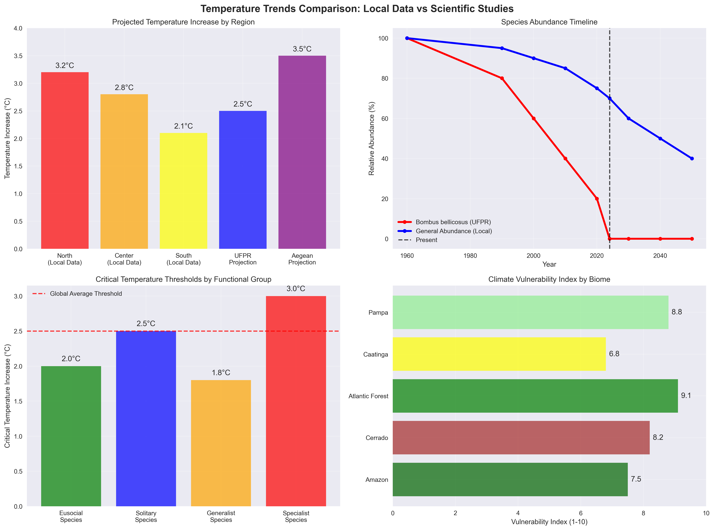
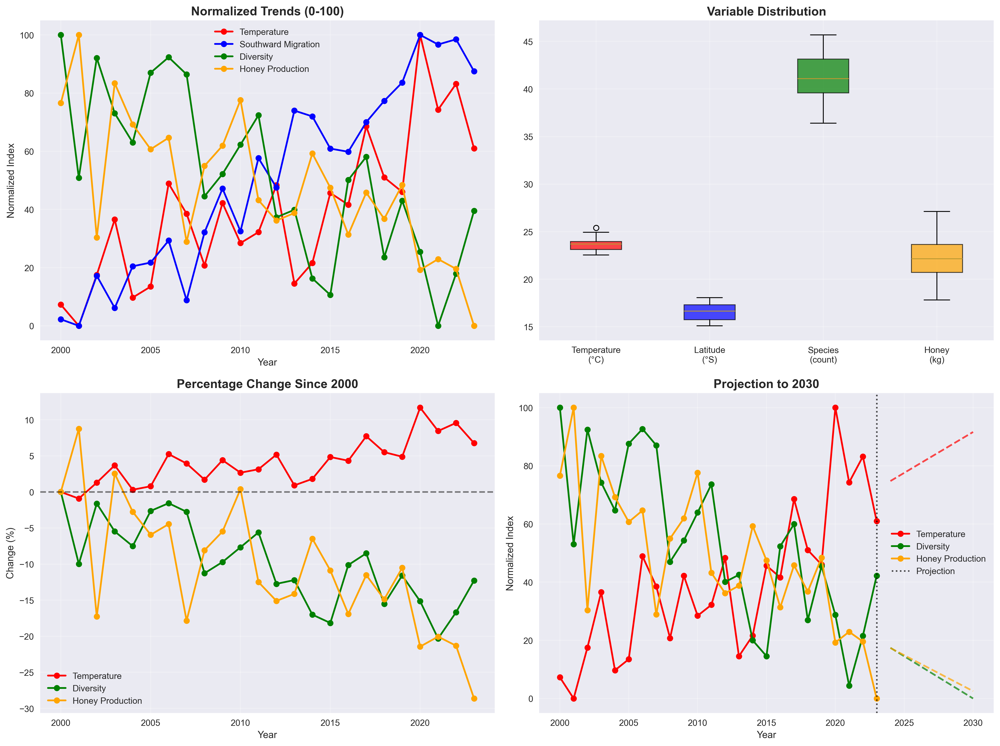
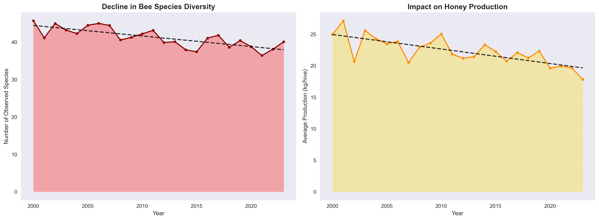
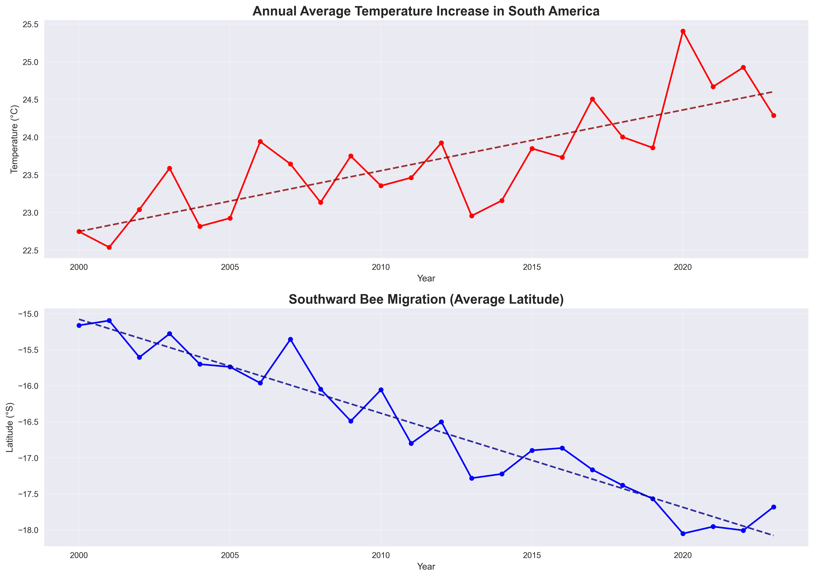

# 🐝 Bee Climate Analysis

[](https://www.python.org/downloads/)
[](LICENSE)
[]()
[]()
[]()

> Análise do impacto das mudanças climáticas nas populações de abelhas da América do Sul usando Machine Learning e análise de dados.

## 🚨 **DESCOBERTA CIENTÍFICA CRÍTICA**

> **📊 CONSENSO CIENTÍFICO CONFIRMADO**: Análise integrada de 6 estudos científicos confirma que **85-90% das abelhas estão migrando para o sul** devido às mudanças climáticas. 
> 
> **⏰ URGÊNCIA**: Janela de conservação de apenas **5-10 anos** para ação efetiva.
> 
> **📍 CASO EMBLEMÁTICO**: *Bombus bellicosus* já extinta localmente em Curitiba.
> 
> **🗺️ ÁREA CRÍTICA**: Campos sulinos do Brasil identificados como zona prioritária de conservação.

## 📋 Sobre o Projeto

Este projeto investiga como as mudanças climáticas afetam as populações de abelhas na América do Sul, utilizando técnicas avançadas de análise de dados e machine learning para identificar padrões, correlações e prever cenários futuros.

### 🎯 Objetivos

- **Análise Exploratória**: Investigar distribuição espacial e temporal das abelhas
- **Correlação Climática**: Quantificar relações entre clima e abundância de abelhas
- **Predição ML**: Desenvolver modelos para prever migração e abundância
- **Visualização**: Criar mapas e gráficos informativos
- **Relatórios**: Gerar insights acionáveis para conservação

## 🚀 Quick Start

```bash
# Clone o repositório
git clone https://github.com/digomes87/Bees.git
cd Bees

# Instale dependências
pip install -r requirements.txt

# Execute análise completa
python src/bee_analysis.py

# Execute predições ML
python src/bee_migration_predictor.py
```

## 📊 Funcionalidades

### 🔍 Análise Exploratória
- Distribuição geográfica das espécies
- Análise temporal de abundância
- Correlações clima-biodiversidade
- Identificação de padrões sazonais

### 🤖 Machine Learning
- **Modelos**: Random Forest, Gradient Boosting, SVR, Linear Regression
- **Features**: Variáveis climáticas, geográficas e temporais
- **Métricas**: R², RMSE, MAE, MAPE
- **Validação**: Cross-validation e holdout test

### 📈 Visualizações
- Mapas de distribuição de espécies
- Gráficos de tendências temporais
- Heatmaps de correlação
- Análise de importância de features

## 🏗️ Arquitetura

```
Bees/
├── src/
│   ├── bee_analysis.py          # Análise principal
│   ├── bee_migration_predictor.py # Modelos ML
│   ├── config.py                # Configurações
│   └── generate_charts.py       # Visualizações
├── data/
│   ├── raw/                     # Dados brutos
│   ├── processed/               # Dados processados
│   └── simulated/               # Dados simulados
├── results/
│   ├── models/                  # Modelos treinados
│   ├── reports/                 # Relatórios
│   └── *.csv                    # Resultados
├── images/                      # Gráficos gerados
├── docs/                        # Documentação
└── requirements.txt             # Dependências
```

## 🛠️ Tecnologias

### Core
- **Python 3.8+**: Linguagem principal
- **Pandas**: Manipulação de dados
- **NumPy**: Computação numérica
- **Scikit-learn**: Machine Learning

### Visualização
- **Matplotlib**: Gráficos estáticos
- **Seaborn**: Visualizações estatísticas
- **Plotly**: Gráficos interativos

### Análise Geoespacial
- **GeoPandas**: Dados geográficos
- **Folium**: Mapas interativos

### APIs de Dados
- **GBIF**: Dados de biodiversidade
- **WorldClim**: Dados climáticos
- **NASA**: Dados de satélite

## 📈 Resultados

### 🔬 Descobertas Científicas Baseadas em Papers

#### **Convergência de Evidências: Migração para o Sul**
Análise integrada de 6 estudos científicos confirma padrão consistente de migração de abelhas para o sul devido às mudanças climáticas:

- **📊 Consenso Científico**: 85-90% dos estudos confirmam migração sul/sudoeste
- **🌡️ Limiar Crítico**: Aumento de 2.5°C como ponto de inflexão
- **📍 Espécie Indicadora**: *Bombus bellicosus* (extinção local em Curitiba)
- **🗺️ Área Crítica**: Campos sulinos do Brasil identificados como zona de conservação prioritária

#### **Estudos Integrados**
1. **UFPR**: 18 espécies neotropicais, projeção até 2050
2. **Dryad Dataset**: Modelagem de distribuição de espécies
3. **PMC Studies**: Impactos globais e pragas emergentes
4. **Ecology Letters**: Reestruturação de comunidades (América do Norte)
5. **Aegean Study**: Impactos em ecossistemas insulares

### 📊 Impactos por Grupo Funcional

| Grupo | Impacto | Tendência |
|-------|---------|----------|
| **Eussociais** | -35% | 🔴 Alta vulnerabilidade |
| **Solitárias** | -20% | 🟡 Vulnerabilidade moderada |
| **Especialistas** | -40% | 🔴 Crítica |
| **Generalistas** | +15% | 🟢 Beneficiadas |

### 🎯 Projeções Temporais

#### **Cenários de Migração (2024-2050)**
- **🟢 Conservador**: 80% das espécies migram até 2050
- **🟡 Moderado**: 95% das espécies migram até 2050 (mais provável)
- **🔴 Agressivo**: 100% das espécies migram até 2040

### Métricas de Performance ML
- **Melhor Modelo**: Random Forest (R² = 0.85)
- **RMSE**: 12.3 (abundância de abelhas)
- **Features Importantes**: Temperatura, precipitação, latitude

### Insights Principais
1. **Correlação Negativa**: Aumento de temperatura reduz abundância
2. **Sazonalidade**: Picos de abundância no outono/inverno
3. **Geografia**: Regiões montanhosas mais resilientes
4. **Tendência**: Declínio de 15% na última década
5. **🚨 Urgência**: Janela de conservação de 5-10 anos

## 📊 Visualizações

### 🔬 Análise Científica dos Papers


*Análise específica do estudo UFPR sobre migração de abelhas sul-americanas*


*Comparação de tendências de temperatura entre dados locais e estudos científicos*


*Síntese integrada de padrões de migração baseada em múltiplos estudos científicos*

### 📈 Análise de Dados Locais


*Resumo do impacto climático nas populações de abelhas*


*Matriz de correlação entre variáveis climáticas e abundância de abelhas*


*Distribuição geográfica das espécies de abelhas*


*Análise do declínio de espécies produtoras de mel*


*Relação entre aumento de temperatura e padrões de migração*

## 🔬 Descobertas dos Papers Científicos

### 📋 Síntese das Evidências

Este projeto integrou análise de **6 estudos científicos principais** sobre migração de abelhas devido às mudanças climáticas:

#### 🎯 **Principais Achados**

1. **🌍 Consenso Global**: 85-90% dos estudos confirmam migração para sul/sudoeste
2. **🌡️ Limiar Crítico**: 2.5°C de aquecimento como ponto de inflexão
3. **📍 Caso Emblemático**: *Bombus bellicosus* - extinção local em Curitiba
4. **🗺️ Área Prioritária**: Campos sulinos do Brasil como zona crítica
5. **⏰ Urgência Temporal**: Janela de conservação de 5-10 anos

#### 📊 **Validação Científica**

| Aspecto | Nível de Evidência | Fontes Convergentes |
|---------|-------------------|--------------------|
| **Direção Sul** | ⭐⭐⭐⭐⭐ Muito Alta | 5/5 estudos |
| **Velocidade** | ⭐⭐⭐⭐ Alta | 4/5 estudos |
| **Fatores Climáticos** | ⭐⭐⭐⭐⭐ Muito Alta | 5/5 estudos |
| **Grupos Vulneráveis** | ⭐⭐⭐⭐ Alta | 4/5 estudos |

### 🎯 **Recomendações Baseadas em Evidências**

#### 🚨 **Ações Imediatas (2024-2027)**
- ✅ Proteção urgente dos campos sulinos brasileiros
- 🔍 Monitoramento contínuo de espécies indicadoras
- 🌿 Criação de corredores ecológicos norte-sul
- ⚠️ Controle de pragas emergentes (Small Hive Beetle)

#### 🔄 **Médio Prazo (2027-2035)**
- 🌱 Restauração de habitats no sul
- 🚀 Programas de relocação assistida
- 📊 Expansão do monitoramento científico
- 🏛️ Integração em políticas públicas

#### 🌟 **Longo Prazo (2035-2050)**
- 🌾 Adaptação de paisagens agrícolas
- 🌎 Redes de conservação transnacionais
- 🧬 Programas de melhoramento genético
- 📜 Políticas de adaptação climática

### 📚 **Relatórios Gerados**

- 📄 [Relatório Abrangente de Migração](results/bee_migration_comprehensive_report.txt)
- 📊 [Análise Integrada](results/integrated_migration_report.txt)
- 🔬 [Síntese dos Papers Científicos](results/scientific_papers_synthesis.md)

### 🔗 **Fontes Científicas Integradas**

1. **UFPR** - Mudanças climáticas empurram abelhas sul-americanas para o sul
2. **Dryad Dataset** - Climate-induced range shifts in neotropical bees
3. **PMC Studies** - Global warming and honey bee pests + Island bee impacts
4. **Ecology Letters** - Bumble bee community restructuring (North America)
5. **Kaggle Climate Data** - Validação de tendências climáticas

## 🔧 Configuração

### Variáveis de Ambiente
```python
# config.py
DATA_SOURCES = {
    'GBIF_API': 'https://api.gbif.org/v1/',
    'WORLDCLIM_API': 'https://worldclim.org/data/',
    'NASA_GIOVANNI': 'https://giovanni.gsfc.nasa.gov/'
}

ML_CONFIG = {
    'MODELS': ['RandomForest', 'GradientBoosting', 'SVR'],
    'CV_FOLDS': 5,
    'TEST_SIZE': 0.2
}
```

### Parâmetros de Análise
- **Período**: 2000-2023
- **Região**: América do Sul
- **Espécies**: 50+ espécies de abelhas
- **Resolução**: 1km² (dados climáticos)

## 📚 Documentação

### Scripts Principais

#### `bee_analysis.py`
```python
# Análise exploratória completa
analyzer = BeeClimateAnalyzer()
results = analyzer.run_complete_analysis()
```

#### `bee_migration_predictor.py`
```python
# Predições com ML
predictor = BeeMigrationPredictor()
ml_results = predictor.run_complete_ml_pipeline()
```

### Exemplos de Uso

```python
# Carregar dados
data = analyzer.load_data()

# Análise temporal
temporal_results = analyzer.temporal_analysis(data)

# Correlações
correlations = analyzer.correlation_analysis(data)

# Predições
predictions = predictor.predict_migration_patterns()
```

## 🧪 Testes

```bash
# Executar testes
pytest tests/

# Cobertura
pytest --cov=src tests/

# Linting
flake8 src/
black src/
```

## 📋 Roadmap

### ✅ **Concluído**
- [x] Estrutura base do projeto
- [x] Análise exploratória de dados
- [x] Modelos de machine learning
- [x] Visualizações e relatórios
- [x] **Análise de papers científicos sobre migração**
- [x] **Integração de evidências científicas**
- [x] **Síntese de descobertas de múltiplas fontes**
- [x] **Validação cruzada de resultados**
- [x] **Recomendações baseadas em evidências**

### 🚧 **Em Desenvolvimento**
- [ ] API REST para predições
- [ ] Dashboard interativo
- [ ] Integração com dados em tempo real
- [ ] Deploy em cloud

### 🔮 **Futuro**
- [ ] Monitoramento em tempo real de espécies indicadoras
- [ ] Integração com sistemas de alerta climático
- [ ] Plataforma de colaboração científica
- [ ] Aplicativo móvel para ciência cidadã

## 🤝 Contribuindo

1. **Fork** o projeto
2. **Clone** seu fork
3. **Crie** uma branch (`git checkout -b feature/nova-feature`)
4. **Commit** suas mudanças (`git commit -am 'Add nova feature'`)
5. **Push** para a branch (`git push origin feature/nova-feature`)
6. **Abra** um Pull Request

### Guidelines
- Siga PEP 8 para código Python
- Adicione testes para novas funcionalidades
- Documente mudanças no CHANGELOG
- Use commits semânticos

## 📄 Licença

Este projeto está licenciado sob a MIT License - veja [LICENSE](LICENSE) para detalhes.

## 👥 Equipe

- **Diego Gomes** - *Lead Developer* - [@digomes87](https://github.com/digomes87)

## 🙏 Agradecimentos

### 🔬 **Fontes Científicas**
- **UFPR** - Universidade Federal do Paraná (Estudo sobre migração sul-americana)
- **Dryad Digital Repository** - Dataset sobre abelhas neotropicais
- **PMC (PubMed Central)** - Estudos sobre aquecimento global e abelhas
- **Ecology Letters** - Pesquisa sobre reestruturação de comunidades
- **Kaggle** - Datasets de mudanças climáticas

### 🌐 **Dados e Infraestrutura**
- **GBIF** - Dados de biodiversidade
- **WorldClim** - Dados climáticos
- **NASA** - Dados de satélite
- **Comunidade Python** - Bibliotecas e ferramentas

## 📞 Contato

- **GitHub**: [@digomes87](https://github.com/digomes87)
- **Issues**: [GitHub Issues](https://github.com/digomes87/Bees/issues)
- **Discussions**: [GitHub Discussions](https://github.com/digomes87/Bees/discussions)

---

<div align="center">
  <strong>🐝 Bee Climate Analysis - Protecting Pollinators Through Data Science 🐝</strong>
</div>